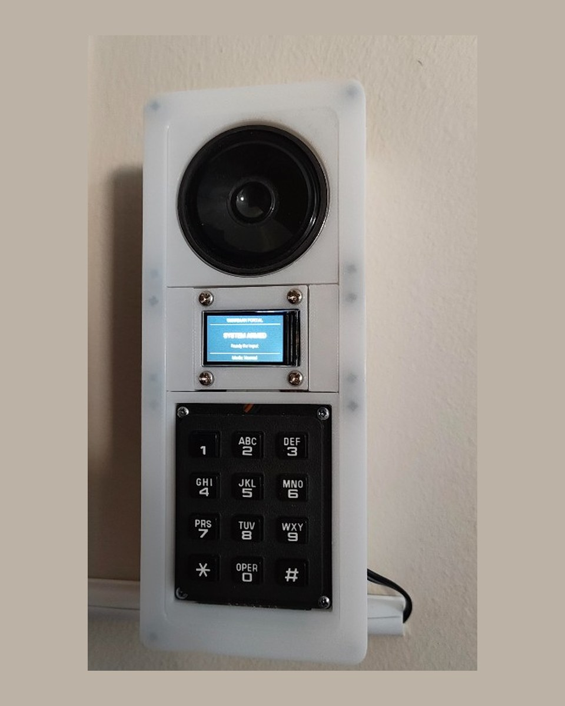
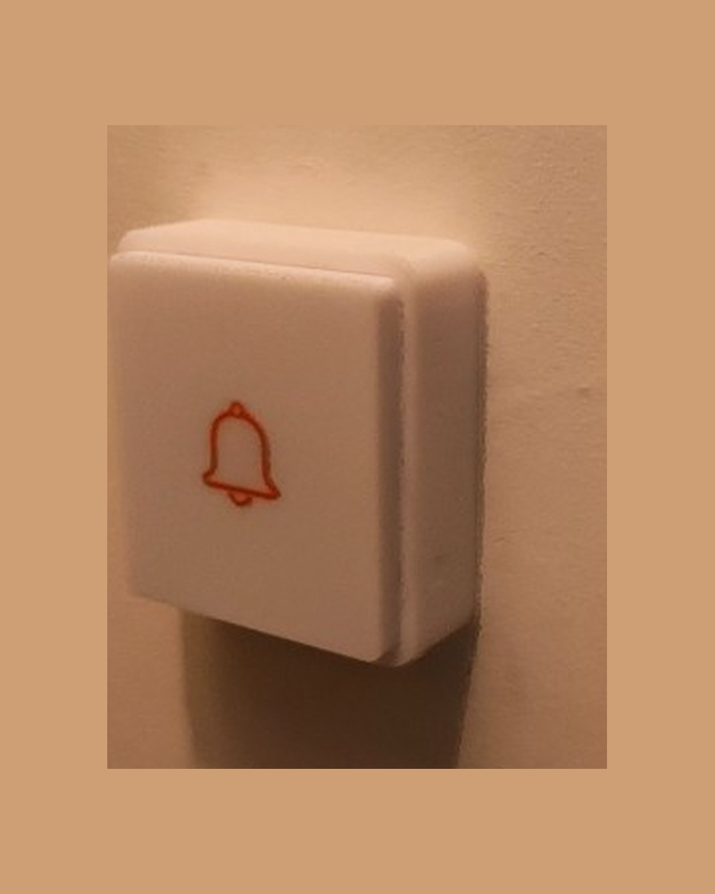
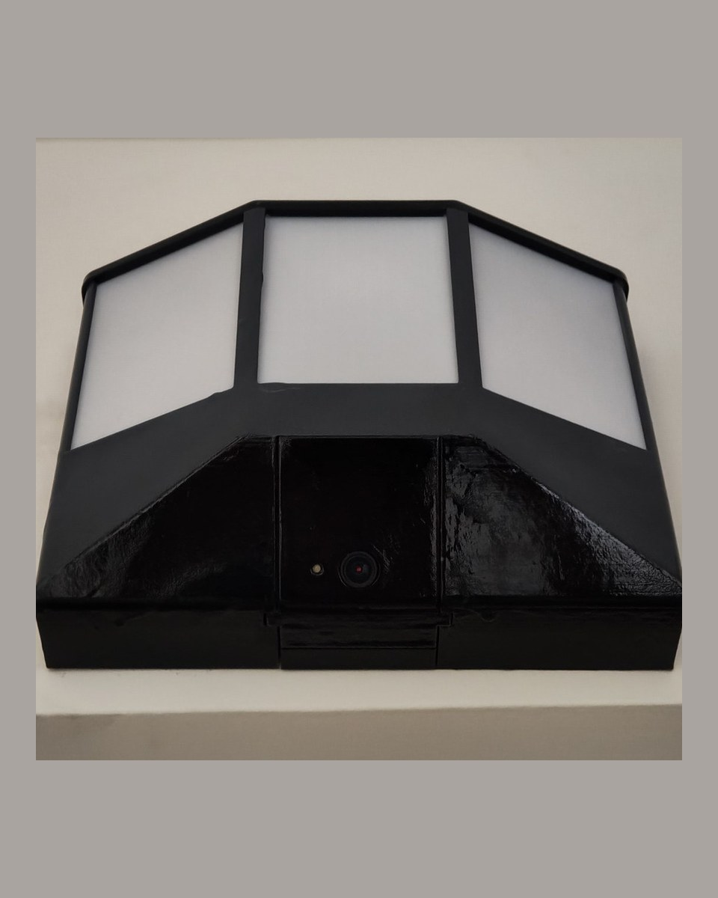

# Guardian System

A home security system built on Home Assistant: RFID entry at two doors, a
keypad-and-display door portal, presence tracking per key, a camera-driven
door lamp, person detection, and an alarm that reaches phones.

**Start here:** [INSTALL.md](INSTALL.md) — from a fresh Home Assistant to a
working system.

> Ready with documented caveats. Not a product, not an add-on, not supported.
> A burglar alarm that fails does so at the worst possible moment. Read the
> caveats below before you run it. MIT, **as is, without warranty**.

<table>
  <tr>
    <td align="center" valign="top" width="33%">
      
      <br /><strong>Interior portal</strong>
    </td>
    <td align="center" valign="top" width="33%">
      
      <br /><strong>Doorbell</strong>
    </td>
    <td align="center" valign="top" width="33%">
      
      <br /><strong>Door lamp</strong>
    </td>
  </tr>
</table>

Step-by-step assembly with more photographs is in
[`docs/documentation/`](docs/documentation/).

## Caveats

1. **No proven alarm without Wi-Fi.** The portal's offline siren compiles
   and has never been heard. Until you flash it and hear it, jamming
   2.4 GHz or stopping Home Assistant silences the house. Cutting power
   to the portal still does: authority is RAM-only.
2. **Printable as 3MF profiles; Gerbers for a proto fab; not
   pick-and-place.** Print files live on MakerWorld and Printables.
   `PCBs/` has KiCad source plus Gerber+drill zips. There is no CPL.
   The door lamp has no PCB — commercial bulb + camera in a printed
   housing.
3. **The outdoor unit holds the card master key in cleartext flash until
   you opt into flash encryption.** That burn is irreversible; a first
   flash over OTA would brick the board. See INSTALL.md § Flash
   encryption. Use NTAG21x; MIFARE Classic is clonable.
4. **One Home Assistant account still works with zero extra setup.** A
   second account can be linked to a key. Tamper detection needs a
   portal reflash.

## What this is

Not application source code. It is the **config tree for a Home
Assistant instance**, plus firmware for two ESP32 devices:

| Piece | What it is |
|---|---|
| **Interior portal** | ESP32 at the main door: RC522 RFID, keypad, 240×135 ST7789 display, LED, door contact, lever IMU, DFPlayer for siren and chirps. |
| **Doorbell unit** | A second ESP32 outside: RFID reader and button. A key works from outside without the portal. |
| **Home Assistant** | Automations, scripts, and helper packages. All the actual logic. |
| **Frigate** | A separate NVR add-on for person detection, reaching Guardian over MQTT. |
| **Guardian panel** | A custom Home Assistant panel in one vanilla-JS ES module. No build step. |

There is no application build and no way to execute this locally. The
only way to run it is a real Home Assistant instance and real hardware.

## What it does

- **Two readers, one decision path.** Every scan dispatches through one
  script. Cloned cards are caught by a rolling counter; keys reported
  stolen sound the siren on the tap.
- **Passage windows.** A valid scan opens a timed grace period. Direction
  is classified from the lever IMU, reader intent, and the door swing.
- **Elevated mode** ("Super Surveillance"), on a switch or up to four
  schedules. An unauthenticated opening while elevated opens a timed
  challenge — card *and* master PIN — before the alarm.
- **Alerting per person.** Each key can link a phone. The alarm, a stolen
  card, and portal tamper are non-maskable.
- **Watchdogs** on the portal, the doorbell, and the Frigate detection
  channel.
- **A door lamp** switched from measured camera luminance, with a
  sun-elevation fallback.

## Print files

Meshes are not in this tree. Download the Bambu Studio profile for each
device from the [MakerWorld collection](https://makerworld.com/en/collections/36079462-guardian-system)
or the [Printables collection](https://www.printables.com/@AntoniJuveni_3576373/collections/3780824):

| Device | Profile | MakerWorld | Printables |
|---|---|---|---|
| Door lamp (Tapo C110 + L530E) | `Lamp-Final.3mf` | [listing](https://makerworld.com/en/models/3347455-guardian-door-lamp-housing-tapo-c110-lantern) | [listing](https://www.printables.com/model/1853736-guardian-door-lantern-tapo-c110-camera-l530e-hidde) |
| Interior portal | `Internal-Portal-Final.3mf` | [listing](https://makerworld.com/en/models/3347482-guardian-interior-portal-keypad-and-display) | [listing](https://www.printables.com/model/1853748-guardian-interior-portal-esp32-s3-keypad-rfid-disp) |
| Doorbell | `Doorbell-Final.3mf` | [listing](https://makerworld.com/en/models/3347498-guardian-outdoor-doorbell-housing-esp32-c6) | [listing](https://www.printables.com/model/1853742-guardian-outdoor-doorbell-housing-esp32-c6) |

## Documentation

| File | Read it for |
|---|---|
| [`INSTALL.md`](INSTALL.md) | Day-one path: prerequisites, file placement, restart, setup wizard, what leaves your network. |
| [`docs/`](docs/) | Hardware index: assembly, printable PDFs, parts checklist, DFPlayer tracks. |
| [`docs/documentation/`](docs/documentation/) | Assembly photographs, soldering order, and a printable PDF per device. |
| [`docs/bom.md`](docs/bom.md) | One-page parts checklist. Not a pick-and-place file. |
| [`PCBs/`](PCBs/) | Two KiCad 10 projects and Gerber+drill zips. |
| [`3D-Models/`](3D-Models/) | Where the print files live (MakerWorld / Printables). This tree does not ship STLs. |
| [`SECURITY.md`](SECURITY.md) | How to report a problem, and what not to paste into an issue. |
| [`CONTRIBUTING.md`](CONTRIBUTING.md) | Preflight, selftest, and how to propose a change. |
| [`DEPLOY.md`](DEPLOY.md) | Maintainer changelog **and** manual test plan. |
| [`docs/maintainers/`](docs/maintainers/) | Audit, panel design, contributor onboarding. |

## Checking a change

There is exactly one automated check, and it is static:

```bash
python tools/guardian-preflight.py
```

It validates that every YAML file parses, that version literals agree,
that script references resolve, that automation ids are unique, that no
secret placeholder survives, that nothing under `www/guardian-ui/`
reaches an external host, and that nothing can quietly cancel an alert.
It makes no network call and reads no credential value.

And one test for that check:

```bash
python tools/guardian-selftest-preflight.py
```

**It does not test behaviour.** Nothing here fires an alarm. For that,
use Home Assistant's *Check configuration* and the numbered steps in
`DEPLOY.md`.

## Security model

Stated plainly, because the parts that are careful could be mistaken for
parts that are enforced.

- **A Home Assistant login is the outer authorization boundary.** The
  panel is `require_admin: false` so a non-administrator can use Keys
  and Notifications. Home Assistant still does not restrict which
  services a non-admin may call from Developer Tools. See
  [`docs/maintainers/GUARDIAN_UI.md`](docs/maintainers/GUARDIAN_UI.md)
  § *Security boundaries*.
- **The siren does not work without Wi-Fi and Home Assistant** on any
  device that has not been flashed with current firmware and then heard.
  The networked siren is an MP3 on the portal's DFPlayer. Jam 2.4 GHz,
  cut power to the access point, or take Home Assistant down and there
  is no *proven* alarm.
- **The card master key is in cleartext flash** on a unit mounted
  outside the door until you opt into flash encryption.
- **MIFARE Classic cards are clonable.** NTAG21x with a password is the
  medium that is actually strong here.
- **Rotating the master key destroys every enrolled card**, both types,
  with no way back.
- **The master PIN hash is weak by construction**: unsalted SHA-256 of
  4–6 digits. It is a second factor at a door, not a secret.
- **Dismissing a live alarm needs no factor.** Any phone holding the
  alarm push can silence it. That is deliberate.
- **Every alarm notification leaves your network** via Apple or Google.
  Do not port-forward Home Assistant. See `INSTALL.md` §10.
- Credentials live in `esphome/secrets.yaml` (gitignored, generated by
  `tools/guardian-gen-secrets.py`), Frigate add-on environment
  variables, and the master PIN.

## Where it actually stands

**Works, in daily use in one household:** RFID entry at both readers,
presence per key, passage windows and direction classification, the
MFA/challenge flow, enrollment, per-person alert routing, the lamp, the
panel, the offline watchdogs.

**Known gaps, deliberately not hidden:**

- Print files are 3MF profiles on MakerWorld / Printables; Gerbers are
  in `PCBs/`. Not pick-and-place.
- Card-crypto and torn-rotate fixes are in the tree and **unverified
  against a real card** since those passes.
- The offline local siren compiles and **has never been heard**.
- Tamper detection needs a portal reflash.
- The alarm path is unverified on hardware since the last several
  passes. `INSTALL.md` §9 and `DEPLOY.md` numbered steps remain the
  proof.
- Frigate integrates over raw MQTT, not the native integration.
- Single-household provenance. This has only ever run on one
  installation.

Early private git history contained a household LAN address and a camera
RTSP URL. This public repository was seeded from a cleaned tree; that
log is not here. If those credentials were ever live, rotate them.

## License

[MIT](LICENSE). This is a burglar alarm provided **as is, without
warranty of any kind**. If you run it, you own the consequences of it
failing.
