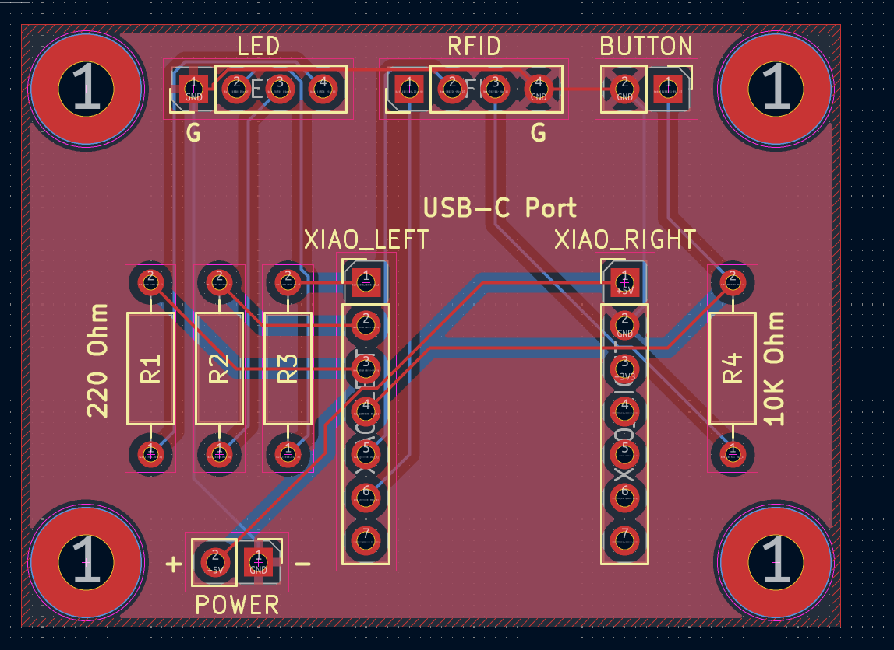
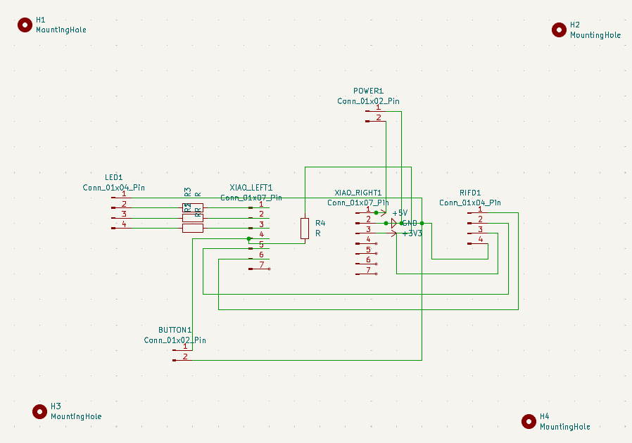
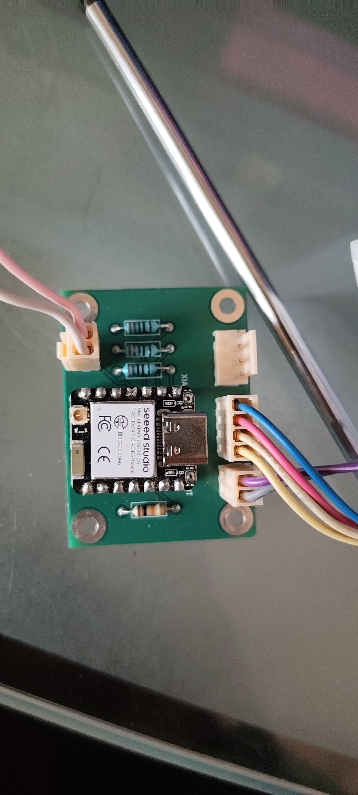
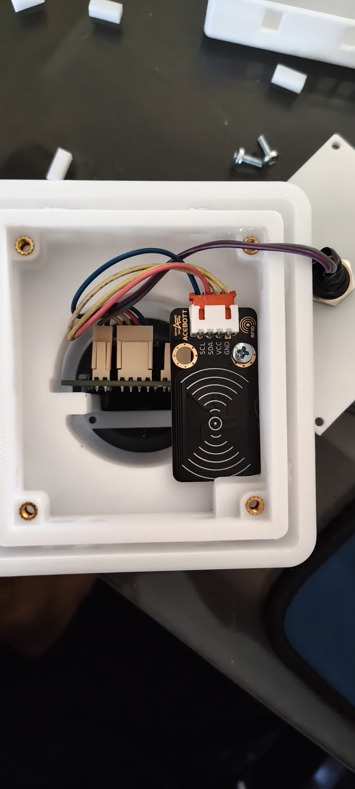
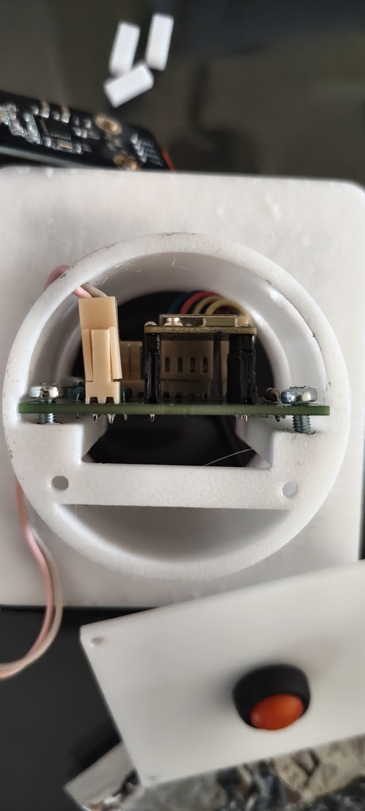
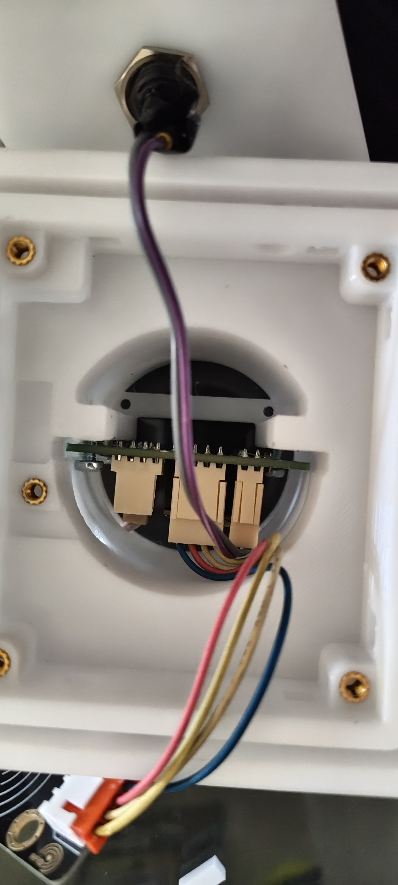
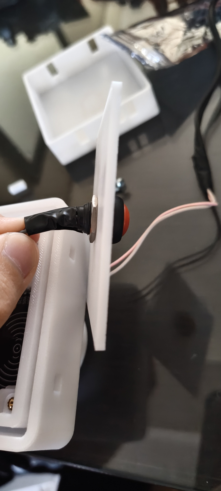
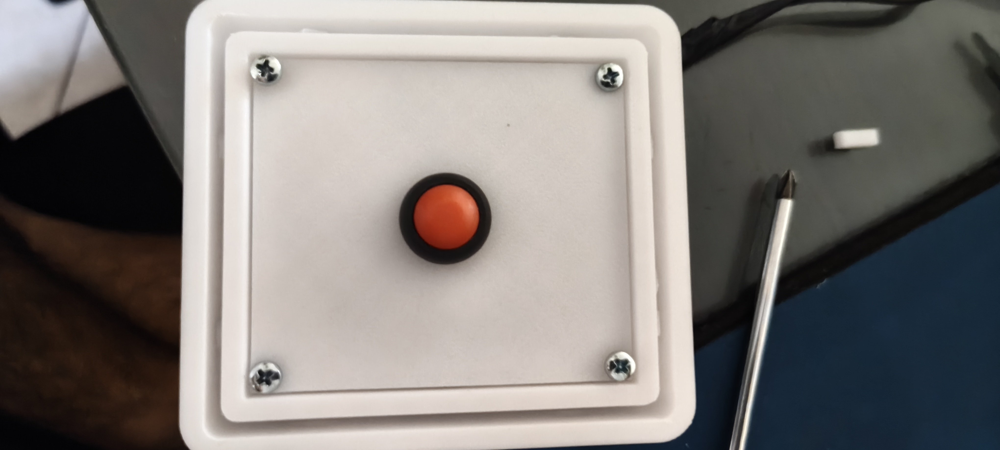
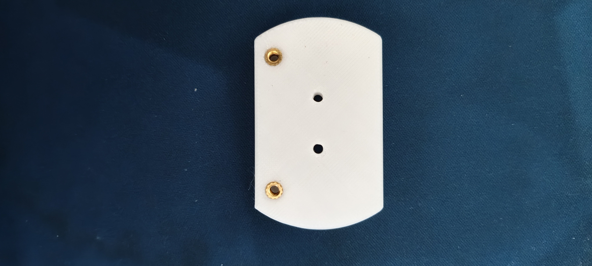

# Doorbell

**Guardian System** — 3D-printed outdoor RFID reader and button.

*This is an in-depth documentation of the Guardian System doorbell module.*

**Download PDF:** [Doorbell-Documentation.pdf](Doorbell-Documentation.pdf)

*Completed doorbell module with the top cover installed.*

# 1. Module Overview

The doorbell module combines 3D-printed parts and a custom PCB. The PCB supports an ESP32, an RFID module, a push button, and an optional RGB LED. It is the exterior reader, so a key works from outside without the portal.

|   |
| --- |
| **3D-printing requirement:** Print `Doorbell-Final.3mf` from MakerWorld or Printables (see [`3D-Models/README.md`](../../../3D-Models/README.md)), in PETG. Supports are already part of the models. |

|   |
| --- |
| **Board files:** KiCad project [`PCBs/Doorbell/`](../../../PCBs/Doorbell/). Send a fab [`Doorbell-Gerbers.zip`](../../../PCBs/Doorbell/Doorbell-Gerbers.zip) (Gerbers + drill). Valued BOM and what is still generic on the schematic: [`PCBs/README.md`](../../../PCBs/README.md). GPIO comes from firmware, not from connector pin numbers — [`INSTALL.md`](../../../INSTALL.md) §1. |

## Document workflow

1. Prepare the hardware and printed parts.
2. Assemble and solder the doorbell PCB.
3. Install the PCB and modules into the printed enclosure.
4. Mount the assembled doorbell into the wall opening.

# 2. PCB Reference

*PCB layout showing the LED, RFID, button, ESP32, resistor, and power positions.*

*Doorbell PCB schematic.*

# 3. Hardware Needed

| **Quantity** | **Component** | **Purpose / note** |
| --- | --- | --- |
| 2 | 1x7 female pin headers | Connector option; see the connector note below. |
| 2 | 1x4 female pin headers | Connector option; see the connector note below. |
| 2 | 1x2 female pin headers | Connector option; see the connector note below. |
| 3 | 220 Ohm THT resistors | For the LED. |
| 1 | 10 kΩ resistor | Push button. Matches the KiCad value and the silkscreen (`10K Ohm` on R4). |
| 15+ | M3 threaded inserts | Used throughout the printed enclosure and mounting parts. |
| 1 | RFID module | RFID reader module. |
| 1 | Push button | Momentary 12 mm red push button. |
| 1 | ESP32 | Seeed Studio XIAO ESP32-C6. |
| 1 optional | 5 mm RGB LED, common anode | Used only for troubleshooting and showing the doorbell connection status. |

|   |
| --- |
| **Connector note:** Any connector that fits the 2.54 mm hole spacing can be used. Female headers can help avoid connector-orientation mistakes. The ESP32 may also be soldered directly to the PCB using male pin headers. |

|   |
| --- |
| **Button resistor:** Use **10 kΩ** on the right of the ESP32 (R4). Earlier drafts of this document said 1 kΩ in the soldering step; that was a leftover from the prototype notes, not the board. Firmware also enables the ESP32 internal pull-up, so the button still works with either value or with no external resistor — solder 10 kΩ so the board matches the silkscreen. |

## Components Used in the Original Build

The following links point to the local Greek technology shop used for the original build:

- M3 threaded inserts: https://grobotronics.com/threaded-insert-m3-5-7x4-6mm.html
- RFID module: https://grobotronics.com/acebott-easy-plug-rfid-rc522-module.html
- Push button: https://grobotronics.com/push-button-momentary-12mm-red.html
- ESP32: https://grobotronics.com/seeed-studio-xiao-esp32-c6.html
- RGB LED (optional): https://grobotronics.com/led-diffused-5mm-rgb-common-anode.html

# 4. PCB Assembly

|   |   |
| :---: | --- |
| **1** | **Install the ESP32** Solder the ESP32 directly to the PCB, or install female headers on the PCB and male headers on the ESP32. Make sure the USB-C port faces the RFID connector. The PCB includes markings to show the correct orientation. |

*Assembled PCB showing the ESP32 orientation, resistors, connectors, and power input.*

|   |   |
| :---: | --- |
| **2** | **Solder the resistors** Solder the three 220 Ω resistors to the left of the ESP32 (RGB LED). Solder the single **10 kΩ** resistor to the right of the ESP32 (push button, R4). |

|   |   |
| :---: | --- |
| **3** | **Install the remaining connectors** Solder the other connectors in any order, while carefully checking their orientation. Follow each cable to its end. The wire from the ESP32 GND pin must connect to the PCB pin marked G. Apply the same check to the LED connection. |

|   |   |
| :---: | --- |
| **4** | **Connect the push button** The push-button connector orientation is not important; either orientation produces the same result. |

|   |   |
| :---: | --- |
| **5** | **Connect power** Power polarity is important. Connect the 5V cable from a regular 5V power supply to the PCB pin marked 5V. Connect the other power pin to ground. |

|   |
| --- |
| **PCB assembly complete:** After the ESP32, resistors, connectors, push button, LED connection, and power input are installed as described above, the doorbell PCB assembly is complete. |

# 5. Final Mechanical Assembly

|   |
| --- |
| **Wall-opening requirement:** The opening must be at least **54 mm in diameter**. The rear mount sits in the cavity behind the wall face, and that cavity must be no deeper than **45 mm** or the screws from the module will not reach. Diameter is the hole you cut; depth is how far the wall box / cavity goes back, not a second diameter. |

|   |   |
| :---: | --- |
| **1** | **Install the first threaded inserts** After printing is complete, place M3 threaded inserts into the four holes in the cone-like area of the main doorbell part. Position each insert in its hole. Instead of inserting the soldering iron through the top holes, touch the insert with the iron tip from the large rear opening. Heat it slowly until it moves into place. |

|   |   |
| :---: | --- |
| **2** | **Prepare the cables before seating the PCB** Connect the cables before placing the PCB into position. This is especially important for the power cable, because connecting it later may require moving the board to the empty side and then moving it back. |

|   |   |
| :---: | --- |
| **3** | **Prepare the push button early** Before connecting the push-button cables, screw the push button to the rectangular 3D-printed part. The button and its cable must be completely free during this process, so this step should be completed early. |

|   |   |
| :---: | --- |
| **4** | **Place and loosely secure the PCB** Place the PCB over the threaded-insert holes with the power pins toward the edge, allowing the cable to be routed through the screw openings. Start fastening the PCB, but do not tighten it fully because the pins extend through the opposite side. It may be difficult to use every screw hole; at least two screw holes are needed. |

|  |  |  |
| :---: | :---: | :---: |

*PCB and RFID module positioning inside the printed enclosure.*

|   |   |
| :---: | --- |
| **5** | **Route the cables and install the RFID module** Route the cables toward the front. Install M3 threaded inserts in the available holes. Screw the RFID module to the single insert positioned farther inside, as shown in the assembly images. |

|   |   |
| :---: | --- |
| **6** | **Install the optional RGB LED** The RGB LED is optional and is used only for troubleshooting and showing the doorbell connection status. Place it in the circular hole at the bottom side of the doorbell, based on the perspective shown in the images. Insert it only lightly; do not push it all the way in, because it may interfere with the top cover. |

|   |   |
| :---: | --- |
| **7** | **Install the push-button plate** Position the rectangular push-button part over the threaded inserts and screw it into place. |

*Side view of the push-button plate during installation.*

|   |   |
| :---: | --- |
| **8** | **Align the top cover** Position the top cover so that its pill-shaped opening aligns with the circular opening on the other part. Place the small rectangular pieces into the openings on both sides of the doorbell body. To remove the cover later, push these pieces inward so the cover can be taken off. |

|   |
| --- |
| **Do not install the top cover yet:** Complete the wall mounting first. Install the top cover only after the doorbell module is fully mounted in the wall opening. |

*Front view of the push-button plate and cover area.*

# 6. Wall Mounting

|   |   |
| :---: | --- |
| **1** | **Prepare the rear mounting part** Install M3 threaded inserts into the bottom holes of the final unused printed part. The middle holes are used for wall mounting. |

|   |   |
| :---: | --- |
| **2** | **Attach the rear part to the wall opening** Place the rear part behind the opening with the threaded-insert holes on the underside. Screw it into place using the mounting method suitable for the installation. |

|   |   |
| :---: | --- |
| **3** | **Secure the doorbell module** With the top cover removed, place the doorbell module into the opening. Use a long screwdriver to install M3 screws through the rear holes of the module. |

*Rear mounting part with two M3 threaded inserts installed in the lower holes.*

|   |   |
| :---: | --- |
| **4** | **Install the top cover** After the module is fully mounted, install the top cover using the alignment and side-retainer method described in the previous section. |

*Final assembled doorbell module.*

Flash the board from [`INSTALL.md`](../../../INSTALL.md) §7 using
[`esphome/doorbell-unit.yaml`](../../../esphome/doorbell-unit.yaml). The
GPIO table in INSTALL §1 is the pin authority (I²C 22/23, button GPIO21,
RGB GPIO0–2).
