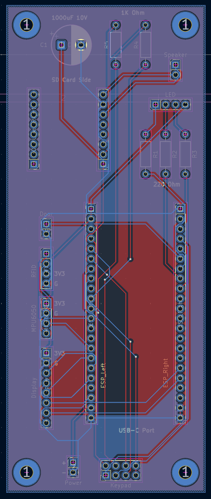
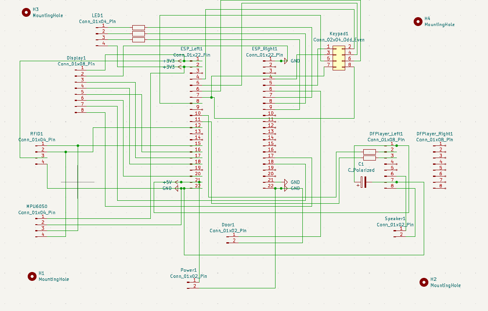
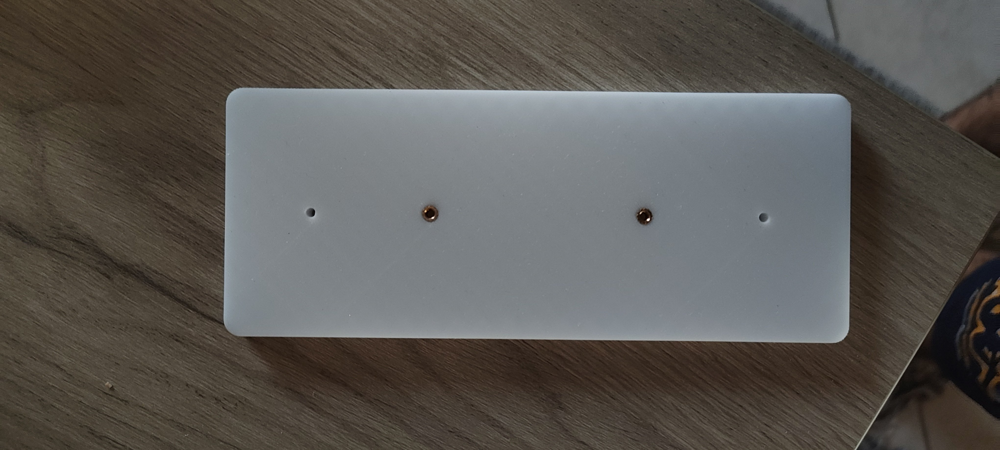
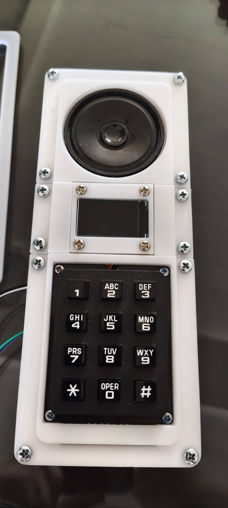
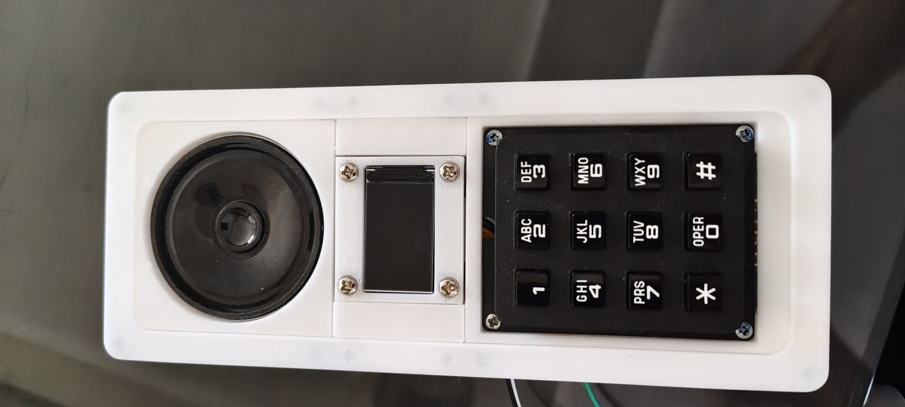
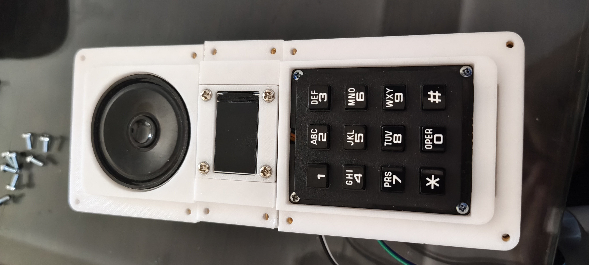

# Interior Portal

**Guardian System** — 3D-printed RFID keypad-and-display module.

*This is an in-depth documentation of the Guardian System Interior Portal module.*

**Download PDF:** [Interior-Portal-Documentation.pdf](Interior-Portal-Documentation.pdf)

*Completed Interior Portal Module, installed and connected.*

# 1. Module Overview

The Interior Portal module combines 3D-printed parts with a custom PCB and a small set of sensors to bring keypad, RFID, and door-state awareness to the Guardian System. It is ESP32-based and includes a keypad, a status display, a speaker with an MP3 playback module, an RFID reader, a door sensor, and a handle-motion sensor.

|   |
| --- |
| **3D-printing requirement:** Print `Internal-Portal-Final.3mf` from [MakerWorld](https://makerworld.com/en/models/3347482-guardian-interior-portal-keypad-and-display) or [Printables](https://www.printables.com/model/1853748-guardian-interior-portal-esp32-s3-keypad-rfid-disp), in PETG. Supports are already part of the models. The cosmetic cap is Top-Screw-Cover — there is no separate Top-Cover for this device. |

|   |
| --- |
| **Board files:** KiCad project [`PCBs/Interior-Portal/`](../../../PCBs/Interior-Portal/). Send a fab [`Interior-Portal-Gerbers.zip`](../../../PCBs/Interior-Portal/Interior-Portal-Gerbers.zip). Valued BOM: [`PCBs/README.md`](../../../PCBs/README.md). GPIO (including the keypad) comes from [`esphome/portal-unit.yaml`](../../../esphome/portal-unit.yaml) — table in [`INSTALL.md`](../../../INSTALL.md) §1. |

## Document workflow

1. Prepare the hardware and printed parts.
2. Assemble and solder the Module PCB.
3. Mount the assembled module, without the electronics installed, onto a wall.
4. Install the PCB and modules into the printed enclosure and finish the build with the covers.

# 2. PCB Reference

*PCB layout showing every installation area for the components and mounting points.*

*PCB schematic.*

# 3. Hardware Needed

| **Qty** | **Component** | **Purpose / note** |
| --- | --- | --- |
| **2** | 1x22 pin female headers | For the ESP32 module |
| **1** | 4x1 pin male pin header | For the keypad connector |
| **3** | 1x2 pin male pin headers | For power, the status LED, and the door sensor |
| **3** | 1x4 pin male pin headers | For the MPU6050, RFID module, and LED |
| **2** | 1x8 female pin headers | For the DFPlayer MP3 module |
| **1** | 1000 µF 10V capacitor | Main power filter capacitor — check the polarity marking on the PCB |
| **2** | 1K Ohm THT resistors | See the PCB silkscreen for exact positions |
| **3** | 220 Ohm THT resistors | See the PCB silkscreen for exact positions |
| **~20** | M3 threaded inserts | Used throughout the main body and the wall mounting base |
| **1** | DFPlayer Mini MP3 module | Plays audio prompts / alerts through the speaker |
| **1** | ESP32-S3 DevKit | Main microcontroller. Firmware is built with `flash_size: 8MB` (octal PSRAM). A 32 MB Waveshare module still runs that build; do **not** change firmware to 32 MB if the chip is 8 MB. |
| **1** | RFID module (RC522) | RFID card / badge reader |
| **1 optional** | 5 mm RGB LED, common anode | Used for troubleshooting and status indication |
| **1** | Magnetic reed switch / door sensor | Detects the door open / closed state |
| **1** | MPU6050 (3-axis gyro/accelerometer) | Detects door-handle movement |
| **1** | Display, 1.14" 240x135 IPS (SPI) | Status / UI screen |
| **1** | Small speaker | Audio output for the DFPlayer module |

|   |
| --- |
| **Connector note:** Any connector that fits the 2.54 mm hole spacing can be used. Female headers can help avoid connector-orientation mistakes. The ESP32 and the MP3 module may also be soldered directly to the PCB using male pin headers. |

## Components Used in the Original Build

The following links point to the local Greek technology shop used for the original build:

- DFPlayer MP3 module: https://grobotronics.com/dfplayer-a-mini-mp3-player.html
- ESP32-S3 DevKit: https://grobotronics.com/waveshare-esp32-s3-32mb.html (32 MB module; firmware still uses 8 MB, which is valid on this chip)
- RFID module: https://grobotronics.com/acebott-easy-plug-rfid-rc522-module.html
- RGB LED (optional): https://grobotronics.com/led-diffused-5mm-rgb-common-anode.html
- Magnetic reed switch / door sensor: https://grobotronics.com/magnetic-reed-switch.html
- MPU6050: https://grobotronics.com/gy-521-mpu6050-3-axis-gyroscope-and-accelerometer-imu.html
- Display: https://grobotronics.com/display-1.14-240x135-ips-spi-interface.html
- M3 threaded inserts: https://grobotronics.com/threaded-insert-m3-5-7x4-6mm.html

# 4. PCB Assembly

|   |
| --- |
| **Prototype note:** Ignore any differences between your PCB and the one shown in the images throughout this documentation — the boards (and the cable routing shown in later photos) have evolved slightly since the original prototype build, mainly to improve ease of assembly. |

|   |   |
| :---: | --- |
| **1** | **Solder the headers** Install all the male and female headers listed in the hardware table at their dedicated spots, as indicated by the PCB labels. |

*Populated PCB showing the header and connector positions, including the ESP32, DFPlayer, and labeled 1x2 / 1x4 connectors.*

|   |   |
| :---: | --- |
| **2** | **Install the ESP32 and DFPlayer** These can also be installed directly onto the PCB using male pin headers. Orientation matters for both: the DFPlayer's SD card slot should point toward the capacitor at the top of the board, and the ESP32's USB-C port should point toward the keypad 2x4 pin header. |

|   |   |
| :---: | --- |
| **3** | **Install the resistors and capacitor** The board has silkscreen indicators showing the value of each resistor and the capacitor. Resistor orientation does not matter, but the capacitor must be installed with the correct polarity — the + side is marked on the PCB. |

*Close-up of the DFPlayer, resistors (R1–R5), and the polarized capacitor once the board is populated.*

|   |   |
| :---: | --- |
| **4** | **Plug the ESP32 and DFPlayer into their headers** If you haven't already installed them directly, plug both modules into their headers now. |

|   |   |
| :---: | --- |
| **5** | **Prepare the speaker** Solder two wires to the pins on the back of the speaker, and pass them through the hole in the speaker's 3D-printed part. Secure the speaker in place using double-sided tape. |

|  |  |
| :---: | :---: |

*Speaker seated in its 3D-printed housing (left), and with the front grille panel and wires in place (right).*

|   |   |
| :---: | --- |
| **6** | **Prepare the display** The 3D-printed top panel needs to be added before the display is secured to the shell piece that goes into the Interior Portal body. Unscrew the 4 screws around the screen — this releases the standoffs at the back. Take the small rectangular top-panel part and position it around the screen, aligning its holes with the display's holes. Pass the screws back through those holes and reinstall the standoffs at the back. Use M3 screws to attach the display assembly to its shell 3D piece, driving the screws in from the back to reach the standoffs. |

*Display assembled into its 3D-printed frame, with the top panel and standoffs installed.*

|   |   |
| :---: | --- |
| **7** | **Prepare the keypad** Solder pins or cables onto the keypad's connector pins from the back side, not the front. Place the keypad into its 3D-printed piece and feed the cables or pins through the hole in the back. Slide the keypad so the tops of the pins are covered by the underside of the 3D-printed piece, then push the other side down. This process exposes the pins on the other side, ready to be cabled to the PCB. |

|  |  |
| :---: | :---: |

*Keypad seated in its 3D-printed frame (left), and secured from the back with its mounting screws (right).*

|   |   |
| :---: | --- |
| **8** | **Wire the keypad to the PCB** Using the PCB pin numbering shown on the board, connect each keypad pin as listed below. |

| **Keypad Pin** | **PCB Pin (label)** |
| --- | --- |
| **1** | Pin 1 (ESP_Right1 – Pin 5) |
| **2** | Pin 2 (ESP_Left1 – Pin 4) |
| **3** | Pin 3 (ESP_Right1 – Pin 4) |
| **4** | Pin 4 (ESP_Left1 – Pin 5) |
| **5** | Pin 5 (ESP_Left1 – Pin 8) |
| **6** | Pin 6 (ESP_Left1 – Pin 6) |
| **7** | Pin 7 (ESP_Left1 – Pin 7) |

The 8th pin on the PCB (up and to the right) is left unused — you can leave it empty. **Optional:** to keep the keypad from moving, secure it with M2 screws and nuts, as shown in the assembly images.

Firmware drives **rows on GPIO4, GPIO7, GPIO6, GPIO5** and **columns on GPIO1, GPIO2, GPIO15**, in that order (`esphome/portal-unit.yaml`). The table above is how those nets are brought out on this PCB. If a flashed board reads the wrong keys, the harness is swapped — do not edit the YAML to match a miswired cable. The GPIO table in [`INSTALL.md`](../../../INSTALL.md) §1 wins if this document and the board ever disagree.

|   |
| --- |
| **Warning:** Ignore the cable routing shown in the images — they show a prototype build; the models and PCB have since been adjusted, and this applies to other steps as well. |

|   |   |
| :---: | --- |
| **9** | **Connect the display** Use the included cable to connect one side to the display module and the other to the pins labeled "Display" on the PCB, making sure the display's 3V pin connects to the top pin of that header. One end of the cable may have spare wires — you may need to solder custom pins onto it. |

*Back of the display module, showing the ribbon connector used for this wiring step.*

|   |   |
| :---: | --- |
| **10** | **Connect the speaker** Connect the speaker cables you soldered earlier to the 1x2 pins labeled "Speaker" on the PCB. Orientation does not matter. |

|   |   |
| :---: | --- |
| **11** | **Connect the optional status LED** If you have chosen to include a status LED, connect it to its pins now. |

|   |   |
| :---: | --- |
| **12** | **Connect the RFID module** As with the display, use the included cable (it may have one spare wire end) to connect the RFID module's connector to the pins on the PCB. As labeled on the PCB, make sure the RFID's ground pin connects to the bottom pin of that header. |

|   |
| --- |
| **PCB assembly complete:** The remaining components — the MPU6050 handle sensor and the door sensor — are connected only after the parts are printed and the PCB is placed inside the main body. Continue with the next two sections to finish the build. |

# 5. Peripheral Module Assembly

Print all the components included with the system files exactly as supplied — the settings are already optimized. Start with the peripheral sensor modules, which are assembled separately before the main enclosure is wired.

*Printed parts overview: the door-handle sensor housing, the Interior Portal main body, and the wall mounting base.*

|   |   |
| :---: | --- |
| **1** | **Assemble the MPU6050 handle module** Solder wires onto the MPU6050 module, then place it inside its corresponding 3D-printed part and slide the top cover into place. |

|  |  |
| :---: | :---: |

*MPU6050 module with wires soldered on (left), and the top cover of its housing, with the cable pass-through visible (right).*

|   |   |
| :---: | --- |
| **2** | **Install the handle module on the door** This part slides onto your door handle. The cables can be routed through the door and into the Interior Portal enclosure. |

*MPU6050 housing clipped onto the door handle, with cables routed toward the Interior Portal.*

|   |   |
| :---: | --- |
| **3** | **Assemble and install the door sensor — frame side** Place the wired reed-switch half into the larger printed piece, slide its cable inside, and secure it with the extruded circular part (double-sided tape may be needed). Use double-sided tape or hot silicone glue to secure this half to the stable part of your door — the door frame. |

|  |  |
| :---: | :---: |

*Door sensor half assembled and mounted at the top corner of the door frame — two views of the same installation.*

*Door sensor shown in context at the top corner of the door frame.*

|   |   |
| :---: | --- |
| **4** | **Assemble and install the door sensor — moving side** Repeat the same process with the other sensor half and its matching 3D-printed component, securing it to the moving part of the door. Align both halves so their sensing faces (the sides with the holes) touch each other when the door is closed — this is what registers a door-open event. |

|   |
| --- |
| **Fit note:** Most of these parts should fit most homes without issue, but the MPU6050 handle housing and the door sensor parts may need to be adjusted in CAD to match your own door hardware. Print files are the `Internal-Portal-Final.3mf` profile; there are no STEP sources in this tree. |

# 6. Final Mechanical Assembly

|   |   |
| :---: | --- |
| **1** | **Solder the threaded inserts** Use the M3 threaded inserts listed in the hardware table in all similarly sized holes on the Interior Portal main body and on the wall mounting base. |

*Wall mounting base with M3 threaded inserts installed in two of its four holes.*

|   |   |
| :---: | --- |
| **2** | **Position the PCB (without screwing it in)** Place the main PCB into the main Interior Portal 3D-printed part, but do not screw it into the threaded inserts yet — that is done only after the whole module has been installed on the wall. |

|   |   |
| :---: | --- |
| **3** | **Mount the RFID module** Screw the RFID module onto the side threaded inserts inside the main body, as shown in the assembly images. |

*PCB and RFID module positioned inside the printed main body, with cables routed toward their connectors.*

|   |   |
| :---: | --- |
| **4** | **Route the peripheral cables** Pass the cables coming from the door sensor and the MPU6050 (originating at the PCB) through their corresponding holes in the main body. |

|   |   |
| :---: | --- |
| **5** | **Connect the MPU6050 and door sensor to the PCB** Solder or connect these cables — this connection can be reversed later if needed. For the MPU6050, make sure the 3V/VCC pin connects to the top PCB connector labeled 3V3. For the door sensor, orientation does not matter. |

|   |   |
| :---: | --- |
| **6** | **Install the optional status LED** Pass the LED (if included) through its hole so that it remains visible from the outside. |

# 7. Wall Mounting

|   |   |
| :---: | --- |
| **1** | **Mount the base plate to the wall** Use screws or double-sided tape to secure the mounting base to the wall — both methods work. |

|   |   |
| :---: | --- |
| **2** | **Secure the main body** Screw the main Interior Portal part onto the threaded inserts of the mounting base. |

|   |   |
| :---: | --- |
| **3** | **Secure the PCB** Now that the module is on the wall, screw the PCB into the main body's threaded inserts. |

|   |   |
| :---: | --- |
| **4** | **Attach the front modules** Screw the keypad, display, and speaker 3D-printed parts onto the top of the main body, connecting each one's cable to the PCB as described in the PCB Assembly section. |

*Speaker, display, and keypad modules screwed onto the front of the wall-mounted main body.*

|   |   |
| :---: | --- |
| **5** | **Install the cosmetic cover** A 3D-printed cover attaches over the front screws to hide them. If friction alone doesn't hold it in place, secure it with double-sided tape. |

|  |  |
| :---: | :---: |

*Completed Interior Portal Module with the cosmetic front cover installed.*

# 8. Sound card

The DFPlayer Mini reads numbered tracks from a microSD card. The serial link
carries playback commands only; the card is wired to the DFPlayer, not to the
ESP32. **Changing a sound means opening the portal.** Firmware and card have
to be updated together.

Format the card FAT32. Put the files in a folder named `MP3` at the root,
using the four-digit names below. `play_mp3` (command 0x12) selects by that
filename. Copying files into the card root in a random order and using the
plain `play` command is how an earlier card played the alarm as a chime.

| File on the card | Firmware `play_mp3` | What it is |
|---|---|---|
| `/MP3/0001.mp3` | file 1 | Doorbell |
| `/MP3/0002.mp3` | file 2 | Access denied |
| `/MP3/0003.mp3` | file 3 | MFA / PIN challenge |
| `/MP3/0004.mp3` | file 4 | **Alarm.** This is the networked siren and the offline local siren. |
| `/MP3/0005.mp3` | file 5 | Welcome / granted |

As of 2.30.0 the firmware sets DFPlayer volume to **30** (module maximum) on
boot. If the alarm is still too quiet after a reflash, the speaker and the
housing are the remaining variables.

Then flash the board: [`INSTALL.md`](../../../INSTALL.md) §7.
